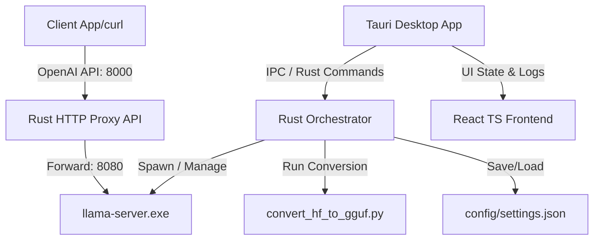

# Implementation Plan - AutoLLAMA Dashboard

We will build a production-ready, enterprise-grade desktop application for Windows to manage local GGUF LLM servers running via `llama.cpp`. The application will combine a high-performance Rust backend (via **Tauri v2**) and a modern React + TypeScript frontend.

## User Review Required

> [!IMPORTANT]
> **Dependencies & Compiling:**
> - To start the `llama-server` process, the user needs to download or compile a version of `llama-server.exe` matching their hardware (CPU-only, CUDA, ROCm, etc.). The dashboard will allow the user to browse their file system to select this executable.
> - **GGUF Conversion:** The application relies on the Python environment already configured in `llama.cpp/venv` to run `convert_hf_to_gguf.py`. The Rust backend will invoke this Python interpreter directly.

> [!WARNING]
> **OpenAI Proxy Gateway:**
> - The Rust backend will run an API Gateway on a fixed user-configured port (default `8000`). This port is public/local and proxies requests to the underlying `llama-server` (running on another port like `8080`).
> - This gateway handles logging, captures token usage from response payloads, monitors average latency, and formats errors cleanly if the server is stopped. By default, it binds to `127.0.0.1` for security.

---

## Proposed Architecture

---

## Proposed Changes

We will scaffold a Tauri project in the workspace root `c:\Users\shahl\workspace\python\AUTOLLAMA`. This allows the application to coexist with the existing `llama.cpp` directory.

### 1. Tauri Backend & Packaging (Rust)

#### [NEW] [Cargo.toml](file:///c:/Users/shahl/workspace/python/AUTOLLAMA/src-tauri/Cargo.toml)
Defines Rust dependencies:
- `tauri` (v2.x)
- `axum` (for the local OpenAI proxy server)
- `tokio` (for async command execution, process management, and HTTP server)
- `serde`, `serde_json` (for serialization)
- `reqwest` (for proxying request payloads to `llama-server`)
- `chrono` (for event timestamps)
- `tower-http` (for CORS policies)

#### [NEW] [main.rs](file:///c:/Users/shahl/workspace/python/AUTOLLAMA/src-tauri/src/main.rs)
Implements:
- **State Management**: Safe sharing of configuration, active process handles, log buffers, and request metrics.
- **Tauri Commands**:
  - `get_settings`, `save_settings` (saves models, server profiles, and general settings)
  - `start_server_process`, `stop_server_process`, `get_server_status`
  - `scan_ports` (scans standard ports to verify availability)
  - `run_conversion` (spawns the python script and streams logs back via Tauri events)
  - `get_metrics`, `clear_metrics`
- **Axum API Proxy**: Runs an HTTP server that listens on the designated API port (e.g. `8000`), receives `/v1/chat/completions` and `/v1/completions` requests, forwards them to the running `llama-server` process, and records metrics (latency, token usage) before returning the response.

### 2. Frontend Application (React + TypeScript)

#### [NEW] [package.json](file:///c:/Users/shahl/workspace/python/AUTOLLAMA/package.json)
Configures React, Vite, TypeScript, and libraries:
- State management: `zustand`
- Icons: `lucide-react`
- UI Styling: Vanilla CSS (utilizing a dark-mode theme, glassmorphism design, and micro-animations)

#### [NEW] [src/index.css](file:///c:/Users/shahl/workspace/python/AUTOLLAMA/src/index.css)
The core design system containing:
- Dark mode CSS variables (harmonious neon blue/violet accents, dark slate backgrounds, subtle gradients)
- Utility classes for glass panels, card containers, glowing inputs, scrollbars, and terminal logs
- Dynamic hover transitions and animation keyframes

#### [NEW] [src/store.ts](file:///c:/Users/shahl/workspace/python/AUTOLLAMA/src/store.ts)
A lightweight Zustand store to manage:
- Active tab / view
- Model Registry list
- Server Profiles list
- Currently running server status (running, stopped, starting, error, CPU/GPU configs)
- Live server log buffer
- Metric history (aggregate token counters, request times)
- General configuration (paths to `llama-server.exe` and Python `venv`)

#### [NEW] [src/App.tsx](file:///c:/Users/shahl/workspace/python/AUTOLLAMA/src/App.tsx)
The main layout providing the navigation sidebar and content panels:
- **Models View**: Registry for local GGUF files. Extract metadata (file size), add custom tags/descriptions, edit/remove models.
- **Server Control View**: Select profiles, tune runtime parameters (port, context size, GPU layers, thread count), start/stop controls, active connection info panel, and an inline "Test Request" playpen.
- **Monitoring View**: Real-time terminal logs with severity filtering, search bar, and download buttons; metric widgets showing uptime, total tokens, average latency, and requests/sec.
- **Conversion View**: HF remote repo converter using the existing Python venv. Select quantization, check progress bar, auto-registers completed GGUF file.
- **Settings View**: Define global executables, save profiles, and restore factory defaults.

---

## Verification Plan

### Automated Tests
1. **Compilation**: Run `cargo build` in `src-tauri` and `npm run build` in the root to ensure no linting/compilation issues.
2. **Mock Inference**: Deploy a mock server profile and test the OpenAI proxy gateway using `curl` or a python test script.

### Manual Verification
1. Verify Tauri desktop app launches and correctly reads configurations from `AppData/Roaming/autollama/config.json`.
2. Select a `.gguf` file, start the server, verify the port conflict warning triggers if another service runs on the target port.
3. Check the real-time logs panel to ensure it streams standard output of the active `llama-server` process.
4. Verify Hugging Face remote conversion downloads and compiles a test model (e.g. a tiny 100M test model or vocab-only) to a local GGUF and auto-registers it.
